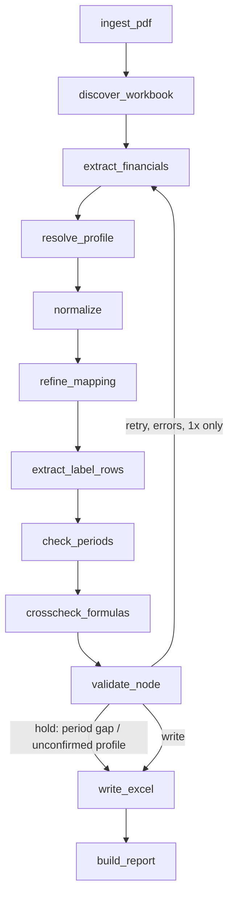

# FinScan architecture

## One-sentence version

A LangGraph state machine takes **(PDF, Excel model)** in, runs the PDF through an
**LLM extraction pass**, then writes the results into the workbook using
**openpyxl** (a plain Python package — no LLM involved in the writing side at
all). The "LLM reads, Python writes" split already is how it works; the
complexity below is the *guardrails* wrapped around that split, not the split
itself.

## End-to-end flow

Each box is a node in `src/finscan/graph/nodes.py`; the wiring is in
`src/finscan/graph/build.py`; the shared state (`src/finscan/graph/state.py`)
is a `TypedDict` passed down the chain.

## The two halves

### 1. Reading the PDF — 100% LLM, no rules-based parsing of numbers

- **`src/finscan/extract/pdf_reader.py`** — turns the PDF into text per page
  (`pdfplumber`), scores each page by numeric density + heading keywords to
  guess which pages are the actual statements (`statement_pages()`), and falls
  back to a **vision LLM call** (render page → PNG → GPT-4o) for pages with no
  text layer, instead of requiring the system Tesseract/poppler binaries.
- **`src/finscan/extract/extractor.py`** — the actual extraction: one
  structured LLM call (`with_structured_output`) against a fixed Pydantic
  schema (`Extraction`/`LineItem` in `src/finscan/schemas.py`). Everything the
  model must get right is pushed into the system prompt (column discipline,
  consolidated-vs-standalone, units, sign conventions) plus a few deterministic
  Python guardrails layered on top of the LLM's answer:
  - `_maybe_realign_quarter_values` — catches the 6M-vs-3M column mixup pattern.
  - `_maybe_rescale_items_to_printed_units` — unit sanity check (catches a
    1000x scale slip between the printed units and the returned values).
  - `_ensure_working_capital_components` — recovers a commonly-dropped
    cash-flow subtotal, first via a deterministic positional rescue, then via
    a focused follow-up LLM call scoped to just those two numbers.
  - `extract_for_labels` — a second, narrower LLM pass used later in the graph
    to resolve workbook rows the taxonomy pass didn't cover, by matching raw
    Excel captions directly against the PDF text.
- **`src/finscan/extract/normalize.py`** — converts whatever scale the PDF was
  printed in (lakhs/crores/millions/...) to one base unit, and derives any
  subtotal that's a strict function of others (never invents numbers the
  filing didn't print).

So: **no numbers are read off the page by regex.** The LLM does 100% of the
reading; the Python code around it is entirely post-hoc sanity-checking of
what the LLM returned.

### 2. Writing the Excel — 100% deterministic Python, no LLM

- **`src/finscan/excel/discovery.py`** — scans the workbook once per run and
  works out, per sheet: which rows are recognized line items, which column is
  "the last populated period" (`reference_col`), and which column is next to
  write into (`write_col`).
- **`src/finscan/excel/style_probe.py`** — reads the **blue/black font-colour
  convention** analysts use (blue = hardcoded input, black = formula) so
  FinScan knows which cells it's even allowed to touch. This is the
  load-bearing signal that lets one engine work across many differently-built
  models without per-company code.
- **`src/finscan/excel/mapper.py`** — maps each row's caption to a canonical
  field: alias table → fuzzy match (rapidfuzz) → LLM (only for what's left
  over). This is the *one* place writing still touches an LLM, and only for
  label matching, never for the numbers themselves.
- **`src/finscan/excel/writer.py`** — the actual `openpyxl` write: copies the
  reference column's formulas forward (`Translator`), pastes extracted values
  only into blue rows, never touches a cell with a live formula, and always
  writes to a **copy** of the source file.

### The stuff around both halves (this is where most of the complexity lives)

| Concern | File | Why it exists |
|---|---|---|
| Is this the right column to write into at all? | `src/finscan/periods.py` | Prevents booking e.g. Q1-26 numbers into a Sep-25 slot silently |
| Does the model's own math reproduce the filing's subtotals? | `src/finscan/crosscheck.py` | Catches a caption mapped to the *wrong* number even though it looks right |
| Per-company memory of layout/overrides | `src/finscan/profiles.py` | So a human confirms a company's sheet layout once, not on every upload |
| Final arithmetic sanity | `src/finscan/validate.py` | Revenue + other income == total income, etc. |
| Orchestration + one retry loop | `src/finscan/graph/build.py`, `nodes.py` | Lets a failed validation re-prompt the extractor once with a hint before giving up |
| HTTP entry point for Copilot Studio | `src/finscan/api/main.py` | propose → confirm-profile → apply, so most companies eventually need zero human input |
| CLI entry point | `src/finscan/cli.py` | `run` / `company` / `batch` / `inspect` / `inspect-pdf` / `profiles` |

## Where the complexity really comes from

It's not the "LLM reads / Python writes" split — that's already exactly one
call each way. The complexity is **independent safety nets**, each fixing one
real failure mode found in production filings:

1. mixed quarter/cumulative columns in one table
2. wrong-scale units (lakhs vs crores vs millions)
3. stale/rightmost-column assumptions when a "Restated" block sits after the
   real data
4. formulas silently pointing at the wrong number even though the caption
   matches
5. period misalignment (writing into the wrong column entirely)
6. ambiguous captions mapping two rows to one canonical field
7. image-only PDF pages with no text layer (fixed via vision-model
   transcription fallback)

If you want to simplify, the lever isn't "switch to LLM-only reading" (already
true) or "switch writing to a Python package" (already `openpyxl`) — it's
deciding which of the safety nets above you're willing to drop, since each one
is what's currently keeping a wrong number from silently landing in the
workbook.
